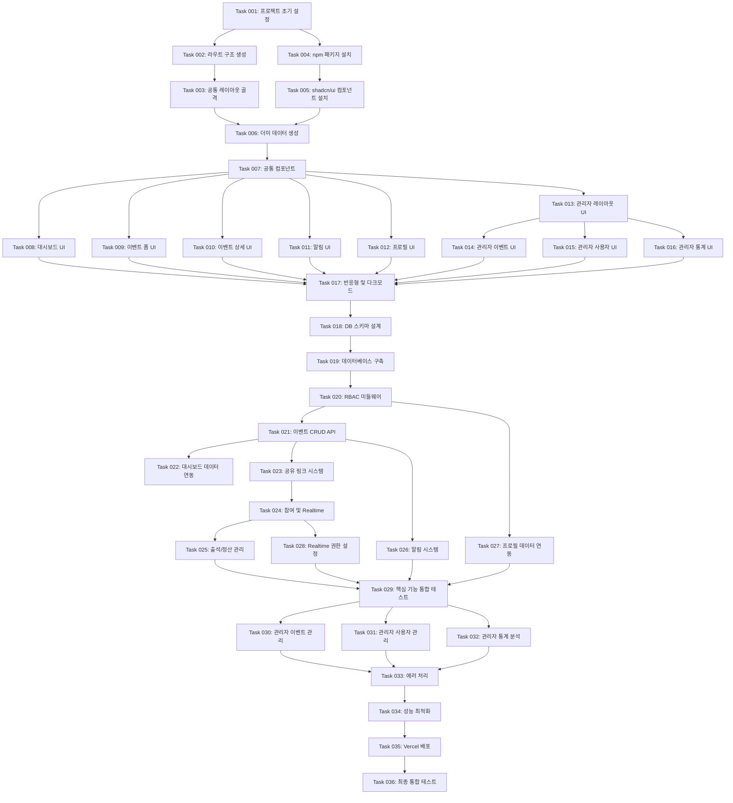

# 모임 이벤트 관리 웹 MVP 개발 로드맵

수영, 헬스, 친구 모임 등의 이벤트를 효율적으로 관리하는 플랫폼

## 개요

모임 이벤트 관리 웹 MVP는 **이벤트 주최자와 참여자**를 위한 **통합 이벤트 관리 플랫폼**으로 다음 기능을 제공합니다:

- **이벤트 생성 및 관리**: 공유 링크를 통한 간편한 초대, 실시간 참여자 추적, 출석 체크
- **정산 시스템**: 1/n 자동 계산, 참여자별 납부 현황 관리, 미납자 추적
- **알림 시스템**: 웹 내 실시간 알림으로 이벤트 변경사항 및 정산 요청 전달
- **관리자 대시보드**: 전체 이벤트 관리, 사용자 역할 제어, 통계 분석 및 시각화

## 개발 워크플로우

> 생성된 ROADMAP.md를 사용하는 개발팀의 실제 작업 프로세스

1. **작업 계획**

- 기존 코드베이스를 학습하고 현재 상태를 파악
- 새로운 작업을 포함하도록 `ROADMAP.md` 업데이트
- 우선순위 작업은 마지막 완료된 작업 다음에 삽입

2. **작업 생성**

- 고수준 명세서, 관련 파일, 수락 기준, 구현 단계 포함
- **API/비즈니스 로직 작업 시 "## 테스트 체크리스트" 섹션 필수 포함**

3. **작업 구현**

- 작업 파일의 명세서를 따름
- 기능과 기능성 구현
- **API 연동 및 비즈니스 로직 구현 시 테스트 수행 필수**
- 각 단계 후 작업 파일 내 단계 진행 상황 업데이트
- 구현 완료 후 E2E 테스트 실행
- 테스트 통과 확인 후 다음 단계로 진행
- 각 단계 완료 후 중단하고 추가 지시를 기다림

4. **로드맵 업데이트**

- 로드맵에서 완료된 작업을 ✅로 표시

## 개발 단계

### Phase 1: 애플리케이션 골격 구축

> 전체 라우트 구조, 타입 정의, 데이터베이스 스키마 설계를 완성하여 개발 기반 마련

- ✅ **Task 001: 프로젝트 초기 설정 및 기본 인증 구현**
  - ✅ Next.js 16 + TypeScript 프로젝트 구조 생성
  - ✅ Supabase 클라이언트 설정 (server, client, proxy)
  - ✅ 구글 OAuth 인증 구현
  - ✅ 기본 미들웨어 세션 관리 (`lib/supabase/proxy.ts`)
  - ✅ shadcn/ui 기본 컴포넌트 설치 (button, card, input, label, badge, checkbox, dropdown-menu)

- ✅ **Task 002: 전체 라우트 구조 및 빈 페이지 생성**
  - ✅ `(mobile)/dashboard` - 일반 사용자 대시보드 페이지 (모바일 레이아웃)
  - ✅ `(mobile)/events/create` - 이벤트 생성 페이지 (모바일 레이아웃)
  - ✅ `(mobile)/events/[id]` - 이벤트 상세 페이지 (모바일 레이아웃)
  - ✅ `(mobile)/events/[id]/edit` - 이벤트 수정 페이지 (모바일 레이아웃)
  - ✅ `(mobile)/share/[token]` - 공유 링크 접근 페이지 (토큰 기반 공개 공유)
  - ✅ `(mobile)/notifications` - 알림 페이지 (모바일 레이아웃)
  - ✅ `(mobile)/profile` - 프로필 페이지 (모바일 레이아웃)
  - ✅ `/admin/dashboard` - 관리자 대시보드 (데스크톱 레이아웃 유지)
  - ✅ `/admin/events` - 이벤트 관리 페이지 (데스크톱 레이아웃 유지)
  - ✅ `/admin/users` - 사용자 관리 페이지 (데스크톱 레이아웃 유지)
  - ✅ `/admin/analytics` - 통계 분석 페이지 (데스크톱 레이아웃 유지)
  - ✅ 모든 사용자 페이지는 `(mobile)` route group으로 이동하여 모바일 우선 레이아웃 적용

- ✅ **Task 003: 공통 레이아웃 및 네비게이션 골격 구현**
  - ✅ BottomNav 컴포넌트 (`components/layout/bottom-nav.tsx`) - Home, Dashboard, Create Event, Notifications, Profile 5개 탭
  - ✅ MobileHeader 컴포넌트 (`components/layout/mobile-header.tsx`) - 모바일 페이지용 간소화된 헤더 (backdrop-blur, sticky)
  - ✅ 모바일 레이아웃 (`app/(mobile)/layout.tsx`) - max-w-[480px] 중앙 정렬, 데스크톱에서도 모바일 UI 표시
  - ✅ 관리자용 사이드바 레이아웃 구조 (`components/admin/admin-sidebar.tsx`) - 데스크톱 전용
  - ✅ 루트 layout.tsx에서 Header 제거, admin layout에만 Header 적용
  - ✅ 다크 모드 토글 컴포넌트 동작 확인
  - **기술 노트**: Next.js 16 설정에서 `cacheComponents: false` 적용 (동적 라우트 호환성 문제 해결)

- **Task 004: 필수 npm 패키지 설치**
  - `react-hook-form` 7+ (폼 상태 관리)
  - `zod` (스키마 검증)
  - `recharts` (차트 라이브러리)
  - `@tanstack/react-table` 8+ (테이블 라이브러리)
  - `sonner` 또는 `react-hot-toast` (Toast 알림)
  - `date-fns` (날짜 포맷팅)
  - package.json 업데이트 및 설치 확인

- **Task 005: shadcn/ui 추가 컴포넌트 설치**
  - `dialog` (모달 대화상자)
  - `toast` (알림 메시지)
  - `select` (드롭다운 선택)
  - `tabs` (탭 네비게이션)
  - `table` (데이터 테이블)
  - `textarea` (긴 텍스트 입력)
  - `calendar` (날짜 선택)
  - `skeleton` (로딩 UI)
  - `alert` (경고 메시지)
  - `avatar` (프로필 이미지)
  - `separator` (구분선)
  - `progress` (진행률 표시)

### Phase 2: UI/UX 완성 (더미 데이터 활용)

> 실제 API 연동 없이 하드코딩된 더미 데이터로 모든 페이지 UI를 완성하여 전체 사용자 플로우 검증. UI 구현 과정에서 실제 필요한 데이터 구조를 파악하여 최종 데이터베이스 스키마 설계에 반영

- **Task 006: 더미 데이터 생성 및 관리 유틸리티 작성**
  - 이벤트 더미 데이터 생성 함수 (`lib/dummy/events.ts`) - 20개 샘플 이벤트
  - 사용자 더미 데이터 생성 함수 (`lib/dummy/users.ts`) - 10명 샘플 사용자
  - 참여자 더미 데이터 생성 함수 (`lib/dummy/participants.ts`)
  - 알림 더미 데이터 생성 함수 (`lib/dummy/notifications.ts`)
  - 통계 더미 데이터 생성 함수 (`lib/dummy/analytics.ts`)
  - 전역 더미 데이터 컨텍스트 또는 상수 파일 (`lib/dummy/index.ts`)

- **Task 007: 공통 컴포넌트 라이브러리 구현**
  - 이벤트 카드 컴포넌트 (`components/events/event-card.tsx`) - 상태 배지, 날짜/장소/참여자 정보 표시
  - 참여자 목록 아이템 컴포넌트 (`components/events/participant-item.tsx`) - 아바타, 이름, 출석/정산 배지
  - 알림 아이템 컴포넌트 (`components/notifications/notification-item.tsx`) - 타입별 아이콘, 읽음 상태
  - 통계 카드 컴포넌트 (`components/admin/stat-card.tsx`) - 아이콘, 숫자, 레이블
  - 빈 상태 컴포넌트 (`components/common/empty-state.tsx`) - 아이콘, 메시지, CTA 버튼
  - 로딩 스켈레톤 컴포넌트 (이벤트 카드, 테이블 등)

- **Task 008: 일반 사용자 대시보드 UI 완성** - 우선순위
  - 헤더 영역 (제목, "새 이벤트 만들기" 버튼)
  - "주최한 이벤트" 섹션 - 더미 이벤트 카드 **세로 리스트** 표시 (모바일 우선)
  - "참여한 이벤트" 섹션 - 더미 이벤트 카드 **세로 리스트** 표시 (모바일 우선)
  - 이벤트 상태별 필터 탭 (전체, 예정, 진행중, 완료)
  - 빈 상태 UI (이벤트 없을 때)
  - **모바일 레이아웃 제약**: max-w-[480px] 컨테이너, pb-16 (하단 네비게이션 여백), flex flex-col 세로 배치

- **Task 009: 이벤트 생성/수정 폼 UI 완성**
  - 이벤트 폼 컴포넌트 (`components/events/event-form.tsx`)
  - 입력 필드: 제목 (텍스트), 설명 (textarea), 카테고리 (select), 날짜 (calendar), 시간 (time picker), 장소 (텍스트), 최대 인원 (숫자), 참가비 (숫자)
  - React Hook Form 통합 (검증 없이 UI만)
  - 폼 검증 에러 메시지 표시 위치 마련
  - "이벤트 만들기" / "수정하기" 버튼
  - "취소" 버튼 (대시보드로 복귀)
  - **모바일 레이아웃 제약**: max-w-[480px] 컨테이너, pb-16, 폼 필드 전체 너비 (w-full)

- **Task 010: 이벤트 상세 페이지 UI 완성**
  - 이벤트 정보 섹션 (제목, 설명, 카테고리 배지, 날짜/시간, 장소, 주최자, 상태 배지)
  - 공유 링크 섹션 (주최자만 표시) - 링크 입력창 + 복사 버튼
  - 참여 신청/취소 버튼 (참여자용, 상태에 따라 텍스트 변경)
  - 실시간 참여자 목록 섹션 (더미 데이터 5명 표시) - 아바타, 이름, 출석/정산 배지
  - 정산 현황 카드 (1인당 금액, 총 금액, 미납자 수, 참여자별 납부 체크박스)
  - 주최자 전용 액션 버튼 (수정, 삭제, 상태 변경 드롭다운)
  - **모바일 레이아웃 제약**: max-w-[480px] 컨테이너, pb-16, 모든 섹션 세로 스택 배치

- **Task 011: 알림 페이지 UI 완성**
  - 페이지 헤더 (제목 "알림", "모두 읽음 처리" 버튼)
  - 알림 목록 (더미 알림 10개) - 최신순 정렬, 안읽음 강조 배경색
  - 알림 타입별 아이콘 (초대: mail, 변경: edit, 정산: dollar-sign, 취소: x-circle)
  - 알림 클릭 시 해당 이벤트로 이동 (더미 링크)
  - 빈 상태 UI (알림 없을 때)
  - 헤더 알림 벨 아이콘 (`components/notifications/notification-bell.tsx`) - 안읽은 개수 배지
  - **모바일 레이아웃 제약**: max-w-[480px] 컨테이너, pb-16, 세로 리스트 레이아웃

- **Task 012: 프로필 페이지 UI 완성**
  - 프로필 카드 (아바타, 이름, 이메일, 역할 배지)
  - 통계 섹션 (주최한 이벤트, 참여한 이벤트, 총 활동 - 더미 숫자)
  - 로그아웃 버튼
  - 프로필 편집 버튼 (MVP 제외지만 UI는 표시, 비활성화)
  - **모바일 레이아웃 제약**: max-w-[480px] 컨테이너, pb-16, 세로 카드 레이아웃

- **Task 013: 관리자 대시보드 레이아웃 UI 완성**
  - 좌측 사이드바 (로고, 4개 메뉴 링크: 대시보드, 이벤트 관리, 사용자 관리, 통계 분석)
  - 현재 페이지 하이라이트 효과
  - 메인 영역 레이아웃 (넓은 컨텐츠 영역)
  - 데스크톱 전용 반응형 (모바일 접근 시 안내 메시지)
  - **관리자 전용**: 데스크톱 전체 너비 레이아웃 유지 (모바일 제약 미적용)

- **Task 014: 관리자 이벤트 관리 UI 완성**
  - 페이지 헤더 (제목 "이벤트 관리", 필터 버튼)
  - 이벤트 테이블 (@tanstack/react-table 사용) - 더미 데이터 20개
  - 테이블 컬럼: 제목, 주최자, 카테고리, 날짜, 상태, 참여자 수, 액션 (수정/삭제 버튼)
  - 상태/카테고리/날짜 필터 드롭다운
  - 페이지네이션 (10개씩)
  - 정렬 기능 (날짜, 제목 등)
  - **관리자 전용**: 데스크톱 전체 너비 레이아웃 유지 (모바일 제약 미적용)

- **Task 015: 관리자 사용자 관리 UI 완성**
  - 페이지 헤더 (제목 "사용자 관리", 통계 카드)
  - 사용자 테이블 - 더미 데이터 15명
  - 테이블 컬럼: 이름, 이메일, 역할, 가입일, 주최 이벤트 수, 참여 이벤트 수, 역할 변경 드롭다운
  - 역할 변경 드롭다운 (user ↔ admin)
  - 검색 필터 (이름/이메일)
  - **관리자 전용**: 데스크톱 전체 너비 레이아웃 유지 (모바일 제약 미적용)

- **Task 016: 관리자 통계 분석 UI 완성**
  - 페이지 헤더 (제목 "통계 분석", 날짜 범위 선택)
  - 카테고리별 이벤트 분포 파이 차트 (Recharts) - 더미 데이터
  - 월별 이벤트 생성 추이 라인 차트 - 더미 데이터
  - 일별 활성 사용자 바 차트 - 더미 데이터
  - 주요 지표 카드 4개 (총 이벤트, 총 사용자, 이번 달 이벤트, 활성 사용자)
  - 데이터 새로고침 버튼
  - **관리자 전용**: 데스크톱 전체 너비 레이아웃 유지 (모바일 제약 미적용)

- **Task 017: 반응형 디자인 및 다크 모드 적용** (부분 완료)
  - ✅ 모바일 우선 디자인: max-w-[480px] 컨테이너, 데스크톱에서도 모바일 UI 중앙 표시
  - ✅ 데스크톱 반응형: 사용자 페이지는 모바일 UI 유지, 관리자 페이지는 전체 너비 레이아웃
  - ✅ 다크 모드: ThemeProvider 기반 동작 확인 (Tailwind dark: variants)
  - 관리자 페이지 반응형 검증 (대기)
  - 터치 인터랙션 최적화 (버튼 크기, 간격) (대기)
  - 접근성 검증 (키보드 네비게이션, ARIA 레이블) (대기)
  - 디자인 시스템 일관성 검증 (색상, 간격, 타이포그래피) (대기)

- **Task 018: 데이터베이스 스키마 설계 및 TypeScript 타입 정의**
  - **Phase 2 UI 구현 결과를 반영하여 최종 스키마 확정**
  - Supabase에서 Enum 타입 설계 (user_role, event_category, event_status, participant_status, notification_type)
  - `profiles` 테이블 role 컬럼 설계 (user_role 타입)
  - `events` 테이블 스키마 설계 (더미 데이터 구조 기반 - 12개 컬럼 + 인덱스)
  - `participants` 테이블 스키마 설계 (8개 컬럼 + 복합 UNIQUE 제약)
  - `notifications` 테이블 스키마 설계 (9개 컬럼)
  - RLS(Row Level Security) 정책 설계 문서화
  - TypeScript 인터페이스 정의 파일 생성 (`types/event.ts`, `types/participant.ts`, `types/notification.ts`)
  - API 응답 타입 정의 (`types/api.ts`)
  - 더미 데이터 구조와 실제 DB 스키마 간 매핑 검증

### Phase 3: 핵심 기능 구현

> 데이터베이스 연동, API 개발, 인증 시스템을 구현하여 더미 데이터를 실제 데이터로 교체

- **Task 019: Supabase 데이터베이스 구축 및 마이그레이션**
  - Supabase MCP를 사용한 마이그레이션 파일 생성
  - Enum 타입 생성 SQL 실행
  - `profiles` 테이블 role 컬럼 추가 및 인덱스 생성
  - `events` 테이블 생성 (12개 컬럼 + 트리거)
  - `participants` 테이블 생성 (8개 컬럼 + 복합 UNIQUE)
  - `notifications` 테이블 생성 (9개 컬럼)
  - RLS 정책 적용 (읽기/쓰기/업데이트/삭제 정책 6개)
  - updated_at 자동 업데이트 트리거 함수 생성
  - TypeScript 타입 재생성 (`lib/supabase/database.types.ts`)

## 테스트 체크리스트

- [ ] 모든 테이블이 Supabase 대시보드에서 확인 가능
- [ ] Enum 타입이 정확히 생성됨
- [ ] RLS 정책이 정상 작동 (비주최자가 타인 이벤트 수정 불가)
- [ ] TypeScript 타입에 모든 테이블 반영됨
- [ ] 컴파일 에러 없음

- **Task 020: 역할 기반 접근 제어 (RBAC) 미들웨어 구현**
  - `middleware.ts` 파일 생성
  - `/admin/*` 경로 보호 (role !== 'admin' 시 /dashboard로 리디렉션)
  - `/dashboard`, `/events/*`, `/notifications`, `/profile` 인증 확인
  - 비로그인 사용자 `/auth/login`으로 리디렉션
  - 로그인 사용자가 `/auth/login` 접근 시 역할별 대시보드로 리디렉션 (admin → /admin/dashboard, user → /dashboard)
  - `lib/supabase/proxy.ts` updateSession 함수 수정 (user 정보 반환)
  - 첫 로그인 시 profiles 테이블에 사용자 레코드 생성 (이름, 이메일, 아바타)

## 테스트 체크리스트

- [ ] 일반 사용자가 /admin 접근 시 /dashboard로 리디렉션
- [ ] 비로그인 사용자가 /dashboard 접근 시 /auth/login으로 리디렉션
- [ ] 관리자가 /admin 정상 접근 가능
- [ ] 로그인 후 역할별 대시보드로 자동 이동
- [ ] 구글 OAuth 로그인 시 profiles 테이블에 레코드 생성 확인

- **Task 021: 이벤트 CRUD API 및 폼 연동**
  - 이벤트 생성 Server Action 또는 API Route (`app/api/events/route.ts` POST)
  - 이벤트 수정 Server Action (`app/api/events/[id]/route.ts` PATCH)
  - 이벤트 삭제 Server Action (`app/api/events/[id]/route.ts` DELETE)
  - 이벤트 상태 변경 Server Action
  - React Hook Form + Zod 검증 스키마 구현 (`lib/validations/event.ts`)
  - 이벤트 폼 컴포넌트에 실제 submit 핸들러 연동
  - 생성/수정 성공 시 Toast 알림 + 이벤트 상세 페이지로 리디렉션
  - 에러 처리 및 사용자 피드백

## 테스트 체크리스트

- [ ] 이벤트 생성 폼 제출 시 Supabase에 레코드 생성
- [ ] 폼 검증 에러 발생 시 인라인 에러 메시지 표시
- [ ] 이벤트 수정 시 기존 데이터 로드 및 업데이트
- [ ] 주최자가 아닌 사용자는 수정 페이지 접근 불가
- [ ] 이벤트 삭제 시 확인 다이얼로그 표시 후 삭제
- [ ] share_link_token이 자동 생성됨

- **Task 022: 일반 사용자 대시보드 실제 데이터 연동**
  - 주최한 이벤트 조회 쿼리 (host_id = user.id)
  - 참여한 이벤트 조회 쿼리 (participants.user_id = user.id AND status = 'confirmed')
  - 더미 데이터를 실제 Supabase 쿼리 결과로 교체
  - 이벤트 상태별 필터링 로직 구현
  - 빈 상태 조건부 렌더링
  - 로딩 상태 스켈레톤 UI 적용

## 테스트 체크리스트

- [ ] 주최한 이벤트가 정확히 표시됨
- [ ] 참여한 이벤트가 정확히 표시됨
- [ ] 이벤트 카드 클릭 시 상세 페이지로 이동
- [ ] 상태 필터가 정상 작동
- [ ] 이벤트 없을 때 빈 상태 UI 표시

- **Task 023: 공유 링크 초대 시스템 구현**
  - 공유 링크 복사 기능 (`components/events/share-link.tsx`)
  - `/events/[token]` 페이지 - share_link_token으로 이벤트 조회
  - 비로그인 사용자 로그인 페이지로 리디렉션 (returnUrl 파라미터 포함)
  - 로그인 후 원래 이벤트로 자동 복귀
  - 공유 링크 접근 시 이벤트 상세 페이지로 리디렉션

## 테스트 체크리스트

- [ ] 공유 링크 복사 버튼 클릭 시 클립보드에 복사됨
- [ ] 비로그인 사용자가 공유 링크 접근 시 로그인 페이지로 리디렉션
- [ ] 로그인 후 원래 이벤트로 자동 이동
- [ ] 잘못된 토큰 접근 시 404 페이지 표시

- **Task 024: 참여 신청/취소 및 실시간 참여자 목록 구현**
  - 참여 신청 Server Action (`participants` 테이블에 INSERT)
  - 참여 취소 Server Action (status = 'cancelled' 업데이트)
  - 참여 상태 확인 API (현재 사용자가 참여 중인지 확인)
  - Supabase Realtime 구독 설정 (`components/events/participants-list.tsx`)
  - Realtime 채널 생성 및 postgres_changes 이벤트 구독
  - 참여자 추가/삭제/수정 시 자동 목록 업데이트
  - 참여 버튼 상태 관리 (참여 신청 ↔ 참여 취소)
  - 최대 인원 초과 시 참여 신청 불가 처리

## 테스트 체크리스트

- [ ] 참여 신청 클릭 시 participants 테이블에 레코드 생성
- [ ] 참여 취소 클릭 시 status가 'cancelled'로 변경
- [ ] 다른 브라우저 탭에서 참여자 추가 시 실시간 반영 확인
- [ ] 최대 인원 초과 시 참여 신청 버튼 비활성화
- [ ] Realtime 연결 실패 시 에러 처리

- **Task 025: 출석 체크 및 정산 현황 관리 구현**
  - 출석 체크 토글 Server Action (attended 필드 업데이트)
  - 정산 완료 토글 Server Action (payment_confirmed 필드 업데이트)
  - 1/n 정산 자동 계산 로직 (총 비용 / 참여자 수)
  - 미납자 필터링 및 강조 표시 (빨간색)
  - 주최자만 체크박스 활성화 (참여자는 읽기 전용)
  - 정산 현황 카드 실시간 업데이트 (Realtime 연동)

## 테스트 체크리스트

- [ ] 주최자가 출석 체크박스 토글 시 즉시 업데이트
- [ ] 정산 체크박스 토글 시 즉시 업데이트
- [ ] 1인당 금액이 정확히 계산됨
- [ ] 미납자가 빨간색으로 강조 표시
- [ ] 참여자는 체크박스 비활성화 상태

- **Task 026: 웹 내 알림 시스템 구현**
  - 알림 생성 유틸리티 함수 (`lib/notifications/create-notification.ts`)
  - 이벤트 변경 시 참여자에게 자동 알림 생성 (트리거 또는 Server Action)
  - 정산 요청 알림 생성 로직
  - 알림 목록 조회 API (최신순 정렬)
  - 알림 읽음 처리 Server Action (read = true)
  - "모두 읽음 처리" 버튼 구현
  - 헤더 알림 벨 아이콘에 안읽은 개수 배지 표시 (Realtime 연동)
  - 알림 클릭 시 해당 이벤트로 이동 + 읽음 처리

## 테스트 체크리스트

- [ ] 이벤트 수정 시 참여자에게 알림 자동 생성
- [ ] 알림 페이지에서 최신 알림이 상단에 표시
- [ ] 알림 클릭 시 읽음 처리되고 이벤트로 이동
- [ ] 헤더 벨 아이콘에 안읽은 알림 개수 표시
- [ ] "모두 읽음 처리" 버튼 클릭 시 전체 알림 읽음 처리
- [ ] 새 알림 생성 시 실시간으로 배지 업데이트

- **Task 027: 프로필 페이지 실제 데이터 연동**
  - 현재 사용자 프로필 정보 조회 (profiles 테이블)
  - 주최한 이벤트 수 집계 쿼리
  - 참여한 이벤트 수 집계 쿼리
  - 완료한 이벤트 수 집계 쿼리
  - 로그아웃 Server Action 구현
  - 통계 데이터를 실제 쿼리 결과로 교체

## 테스트 체크리스트

- [ ] 프로필 정보가 정확히 표시됨 (이름, 이메일, 아바타)
- [ ] 주최/참여/완료 이벤트 수가 정확히 집계됨
- [ ] 역할 배지가 올바르게 표시됨 (user/admin)
- [ ] 로그아웃 버튼 클릭 시 세션 종료 및 홈으로 리디렉션

- **Task 028: Supabase Realtime 권한 설정 및 최적화**
  - Supabase 대시보드에서 Realtime 활성화 (participants, notifications 테이블)
  - Realtime 브로드캐스트 권한 설정
  - 불필요한 Realtime 구독 정리 (메모리 누수 방지)
  - useEffect cleanup 함수에서 채널 구독 해제
  - 여러 브라우저 탭에서 실시간 동기화 테스트

## 테스트 체크리스트

- [ ] participants 테이블 변경 시 실시간 반영 확인
- [ ] notifications 테이블 변경 시 실시간 반영 확인
- [ ] 여러 탭에서 동시 접속 시 동기화 정상 작동
- [ ] 채널 구독 해제 시 메모리 누수 없음
- [ ] Realtime 연결 상태 모니터링 가능

- **Task 029: 핵심 기능 통합 테스트**
  - 사용자 여정 E2E 테스트 (회원가입 → 이벤트 생성 → 공유 → 참여 신청 → 출석/정산)
  - API 엔드포인트 통합 테스트 (이벤트 CRUD, 참여, 알림)
  - RLS 정책 검증 (권한 없는 사용자 접근 차단)
  - 에러 핸들링 시나리오 테스트 (네트워크 오류, 유효하지 않은 입력)
  - 엣지 케이스 테스트 (최대 인원 초과, 중복 참여 신청, 삭제된 이벤트 접근)

## 테스트 체크리스트

- [ ] 전체 사용자 플로우가 끊김 없이 작동
- [ ] 모든 API 엔드포인트가 정상 응답
- [ ] 권한 없는 사용자가 타인 이벤트 수정 불가
- [ ] 네트워크 오류 시 적절한 에러 메시지 표시
- [ ] 최대 인원 초과 시 참여 신청 차단
- [ ] 삭제된 이벤트 접근 시 404 페이지 표시

### Phase 4: 고급 기능 및 최적화

> 관리자 기능, 성능 최적화, 배포를 완성하여 프로덕션 준비

- **Task 030: 관리자 이벤트 관리 실제 데이터 연동**
  - 전체 이벤트 조회 API (관리자 전용, RLS 바이패스)
  - 이벤트 상태/카테고리/날짜 필터링 로직 구현
  - @tanstack/react-table 데이터 바인딩
  - 정렬 기능 구현 (날짜, 제목, 참여자 수)
  - 페이지네이션 로직 구현 (10개씩)
  - 이벤트 수정/삭제 Server Action (관리자 권한 확인)

## 테스트 체크리스트

- [ ] 관리자가 전체 이벤트 조회 가능
- [ ] 필터가 정상 작동 (상태, 카테고리, 날짜)
- [ ] 정렬 기능이 정상 작동
- [ ] 페이지네이션이 정상 작동
- [ ] 관리자가 타인 이벤트 수정/삭제 가능
- [ ] 일반 사용자는 관리자 페이지 접근 불가

- **Task 031: 관리자 사용자 관리 실제 데이터 연동**
  - 전체 사용자 조회 API (profiles 테이블)
  - 사용자 역할 변경 Server Action (role 필드 업데이트)
  - 사용자별 주최/참여 이벤트 수 집계 쿼리
  - 검색 필터 구현 (이름/이메일)
  - 사용자 통계 카드 (총 사용자 수, 관리자 수, 이번 달 가입자)

## 테스트 체크리스트

- [ ] 관리자가 전체 사용자 조회 가능
- [ ] 역할 변경 드롭다운이 정상 작동 (user ↔ admin)
- [ ] 사용자별 이벤트 수가 정확히 집계됨
- [ ] 검색 필터가 정상 작동
- [ ] 사용자 통계가 정확히 계산됨

- **Task 032: 관리자 통계 분석 실제 데이터 연동**
  - 카테고리별 이벤트 분포 집계 쿼리
  - 월별 이벤트 생성 추이 집계 쿼리 (최근 12개월)
  - 일별 활성 사용자 집계 쿼리 (최근 30일)
  - Recharts 데이터 바인딩
  - 주요 지표 카드 데이터 연동 (총 이벤트, 총 사용자, 이번 달 이벤트, 활성 사용자)
  - 날짜 범위 선택 필터 구현
  - 데이터 새로고침 버튼 구현

## 테스트 체크리스트

- [ ] 카테고리별 파이 차트가 정확한 데이터로 표시됨
- [ ] 월별 라인 차트가 정확한 데이터로 표시됨
- [ ] 일별 바 차트가 정확한 데이터로 표시됨
- [ ] 주요 지표 카드가 정확히 계산됨
- [ ] 날짜 범위 필터가 정상 작동
- [ ] 새로고침 버튼 클릭 시 데이터 재조회

- **Task 033: 에러 처리 및 로딩 상태 개선**
  - 전역 에러 바운더리 구현 (`app/error.tsx`)
  - 전역 로딩 UI 구현 (`app/loading.tsx`)
  - 각 페이지별 로딩 스켈레톤 추가
  - Toast 알림 일관성 검증 (성공/에러 메시지)
  - 네트워크 오류 처리 (재시도 버튼, 오프라인 안내)
  - 폼 제출 중 로딩 상태 표시

## 테스트 체크리스트

- [ ] 런타임 에러 발생 시 에러 페이지 표시
- [ ] 페이지 로딩 시 스켈레톤 UI 표시
- [ ] 모든 액션에 Toast 피드백 제공
- [ ] 네트워크 오류 시 재시도 버튼 표시
- [ ] 폼 제출 중 버튼 비활성화 및 로딩 스피너 표시

- **Task 034: 성능 최적화 및 캐싱 전략**
  - Next.js 이미지 최적화 (next/image 컴포넌트 사용)
  - 정적 페이지 ISR 설정 (홈, 랜딩 페이지)
  - Supabase 쿼리 최적화 (인덱스 활용, 불필요한 JOIN 제거)
  - React 컴포넌트 메모이제이션 (useMemo, React.memo)
  - 번들 크기 최적화 (dynamic import, tree shaking)
  - Lighthouse 성능 점수 측정 및 개선 (목표: 90 이상)

## 테스트 체크리스트

- [ ] 이미지 로딩 속도 개선 확인
- [ ] Lighthouse Performance 점수 90 이상
- [ ] 번들 크기 최적화 확인 (main bundle < 200KB)
- [ ] 불필요한 리렌더링 제거 확인
- [ ] 페이지 로딩 시간 3초 이내

- **Task 035: Vercel 배포 및 환경 변수 설정**
  - Vercel 프로젝트 생성 및 GitHub 연동
  - 환경 변수 설정 (NEXT_PUBLIC_SUPABASE_URL, NEXT_PUBLIC_SUPABASE_PUBLISHABLE_KEY)
  - Supabase OAuth Redirect URL 설정 (프로덕션 도메인)
  - 자동 배포 설정 (main 브랜치 push 시)
  - 프리뷰 배포 확인 (PR 생성 시)
  - 커스텀 도메인 설정 (선택)

## 테스트 체크리스트

- [ ] 프로덕션 URL 접속 가능
- [ ] 구글 OAuth 로그인 정상 작동
- [ ] Supabase 연결 정상
- [ ] 환경 변수가 올바르게 적용됨
- [ ] 프리뷰 배포가 정상 작동

- **Task 036: 최종 통합 테스트 및 버그 수정**
  - 전체 사용자 여정 테스트 (PRD 기준)
  - 크로스 브라우저 테스트 (Chrome, Firefox, Safari, Edge)
  - 모바일 반응형 테스트 (iOS Safari, Android Chrome)
  - 보안 검증 (RLS 정책, CSRF 방지, XSS 방지)
  - 접근성 검증 (키보드 네비게이션, 스크린 리더)
  - 발견된 버그 수정 및 재테스트

## 테스트 체크리스트

- [ ] PRD의 모든 기능이 정상 작동
- [ ] 모든 브라우저에서 정상 작동
- [ ] 모바일에서 정상 작동
- [ ] 보안 취약점 없음
- [ ] 접근성 기준 충족
- [ ] 알려진 버그 없음

## 기술적 의존성 관계

## 품질 체크리스트

### 📋 기본 요구사항

- [x] PRD의 모든 핵심 요구사항이 Task로 분해되었는가?
- [x] Task들이 적절한 크기로 분해되었는가? (1-2주 내 완료 가능)
- [x] 각 Task의 구현 사항이 구체적이고 실행 가능한가?
- [x] 전체 로드맵이 실제 개발 프로젝트에서 사용 가능한 수준인가?

### 🏗️ 구조 우선 접근법 준수

- [x] Phase 1에서 전체 애플리케이션 구조와 빈 페이지들이 우선 구성되었는가?
- [x] Phase 2에서 UI/UX가 더미 데이터로 완성되는 구조인가?
- [x] Phase 3에서 실제 데이터 연동과 핵심 로직이 구현되는가?
- [x] 각 Phase가 이전 Phase에 과도하게 의존하지 않고 병렬 개발이 가능한가?
- [x] 공통 컴포넌트와 타입 정의가 적절히 초기 Phase에 배치되었는가?

### 🔗 의존성 및 순서

- [x] 기술적 의존성이 올바르게 고려되었는가?
- [x] UI와 백엔드 로직이 적절히 분리되어 독립 개발이 가능한가?
- [x] 중복 작업을 최소화하는 순서로 배치되었는가?

### 🧪 테스트 검증

- [x] API 연동 및 비즈니스 로직 구현 Task에 테스트가 포함되었는가?
- [x] 각 작업 파일에 "## 테스트 체크리스트" 섹션이 명시되었는가?
- [x] 모든 사용자 플로우에 대한 E2E 테스트 시나리오가 정의되었는가?
- [x] 에러 핸들링 및 엣지 케이스 테스트가 고려되었는가?
- [x] Phase 3에 통합 테스트 Task가 포함되었는가?

### 💡 추가 고려사항

- [x] **기술 스택**: Next.js 16+, Supabase, shadcn/ui, React Hook Form, Zod, Recharts 반영
- [x] **사용자 경험**: 사용자 플로우와 핵심 경험 우선 고려 (구조 → UI → 기능 순서)
- [x] **확장성**: Phase별 독립성으로 향후 기능 추가 용이
- [x] **보안**: RLS 정책, RBAC 미들웨어, 입력 검증으로 보안 강화
- [x] **성능**: Realtime 최적화, 이미지 최적화, 번들 크기 최적화 포함

---

## 📝 로드맵 업데이트 이력

**v1.2 (2026-01-03)**

- **모바일 우선 UI 아키텍처 구현 완료**
- **완료된 작업**:
  - Task 002: 전체 라우트 구조를 `(mobile)` route group 기반으로 재구성
  - Task 003: BottomNav, MobileHeader 컴포넌트 구현, 모바일 레이아웃 적용
- **주요 변경 사항**:
  - 모든 사용자 페이지를 `app/(mobile)/` route group으로 이동
  - 공유 링크 라우트 변경: `/events/[token]` → `(mobile)/share/[token]`
  - 루트 layout.tsx에서 Header 제거, admin layout에만 Header 적용
  - 모바일 레이아웃: max-w-[480px] 컨테이너, 데스크톱에서도 모바일 UI 중앙 표시
  - 하단 네비게이션: 고정 위치, /auth 경로에서 자동 숨김
  - 모바일 헤더: sticky 위치, backdrop-blur 효과
- **기술 노트**:
  - Next.js 16 설정에서 `cacheComponents: false` 적용 (동적 라우트 호환성 문제 해결)
  - 레이아웃 계층: root layout → (mobile)/layout.tsx → page, admin/layout.tsx → page
- **Phase 2 UI Task 업데이트**:
  - Task 008-012: 모바일 레이아웃 제약 조건 추가 (max-w-[480px], pb-16, flex flex-col)
  - Task 013-016: 관리자 전용 레이아웃 유지 (모바일 제약 미적용)
  - Task 017: 부분 완료 상태로 변경 (모바일 우선 디자인, 데스크톱 반응형, 다크 모드 완료)

**v1.1 (2026-01-02)**

- **구조 조정**: 데이터베이스 스키마 설계를 Phase 2 완료 직후로 이동 (Task 018)
- **이유**: UI/UX 구현 과정에서 실제 데이터 구조 요구사항이 명확해지므로, 더미 데이터 기반 UI 완성 후 최종 스키마 설계가 더 효율적
- **변경 사항**:
  - Phase 1에서 DB 스키마 설계 제거
  - Phase 2 마지막에 Task 018로 DB 스키마 설계 추가
  - 더미 데이터 구조를 실제 DB 스키마로 매핑하는 검증 단계 포함

**v1.0 (2026-01-02)**

- 초기 로드맵 생성 (development-planner 에이전트 형식 준수)

---

**작성일**: 2026-01-02
**마지막 업데이트**: 2026-01-03 (v1.2)
**총 Task 수**: 36개
**완료**: 3개 | **진행중**: 0개 | **대기**: 33개
